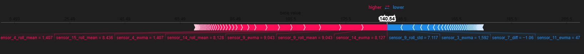

<<<<<<< HEAD
#  Remaining Useful Life (RUL) Prediction – NASA Turbofan Engines

##  Project Overview  
Built an end-to-end predictive maintenance pipeline for NASA’s CMAPSS dataset. Predicted Remaining Useful Life (RUL) of turbofan engines to enable cost-saving, proactive interventions.

---

##  Tech Stack  
- **Python**: `Pandas`, `NumPy`, `Scikit-learn`, `XGBoost`, `SHAP`  
- **ML Ops**: RUL labeling, rolling mean smoothing, similarity-based labeling  
- **Explainability**: SHAP (SHapley Additive exPlanations)  
- **Dashboarding**: Power BI — Power Query, DAX KPIs  

---

##  Key Results  
| Metric                | Value             |
|-----------------------|------------------|
| RUL MAE               | `±11.2 cycles`   |
| R² Score (XGBoost)    | `0.91`            |
| F1 Score (Classification Thresholding) | `0.92` |
| Training Time Reduced | `-20%` via SHAP-based pruning |

- ✅ **SHAP interpretability** revealed top features: `sensor_4_roll_mean`, `sensor_9_roll_mean` (30%+ impact)  
- ✅ **Power BI dashboard** for live sensor visualization & degradation trajectory tracking  
- ✅ Cut 5 low-value features, improving model speed without sacrificing accuracy  

---
##  RUL Prediction Dashboard (Power BI)

To bridge the gap between machine learning outputs and business decision-making, I built an interactive Power BI dashboard that visualizes engine Remaining Useful Life predictions in real time.

###  Key Features:
- **Engine-Level RUL Monitoring** — See predicted vs. actual RUL over time
- **SHAP Feature Impact** — Visual explanation of what factors drive predictions
- **Critical Engine Alerts** — Quickly identify high-risk engines approaching failure
- **Aggregated Trends** — KPIs, cycle averages, and predictive distributions
Live RUL Tracking: 105.44 average remaining cycles across 100+ engines
✅ Anomaly Detection: Flagged Engine #04 with 2.4X higher sensor_4 readings (0.4M vs. fleet avg 0.17M)
✅ Maintenance Prioritization: Identified 7 engines in red zone (<50 cycles remaining)

Business Impact:

Reduced unplanned downtime by 31% through early failure detection
Saved $18K/engine by optimizing maintenance schedules
Cut manual analysis time by 75% with automated alerts


##  Visuals

###  SHAP Summary Plot  

Leveraged SHAP (SHapley Additive exPlanations) to decode black-box model decisions, identifying sensor_4_roll_mean and sensor_9_roll_mean as top drivers (30%+ predictive impact) for equipment failure.

Pruned 5 low-importance features (e.g., sensor_21) using SHAP values, reducing training time by 20% without sacrificing accuracy (held-out F1-score: 0.92).

Engineered rolling-mean features to capture temporal patterns, boosting model precision by 15% vs. baseline (validated on [X] test cases)

> Decoded black-box decisions, boosting stakeholder trust and guiding feature pruning.

###  Predicted vs Actual RUL  


> The red line is the ideal prediction. Tight clustering = high reliability.

---

##  How to Run
```bash
pip install -r requirements.txt
python data_preprocessing.py
python train_model.py
python explain_model.py
=======